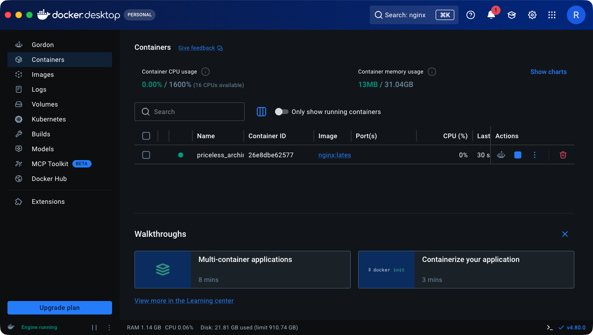
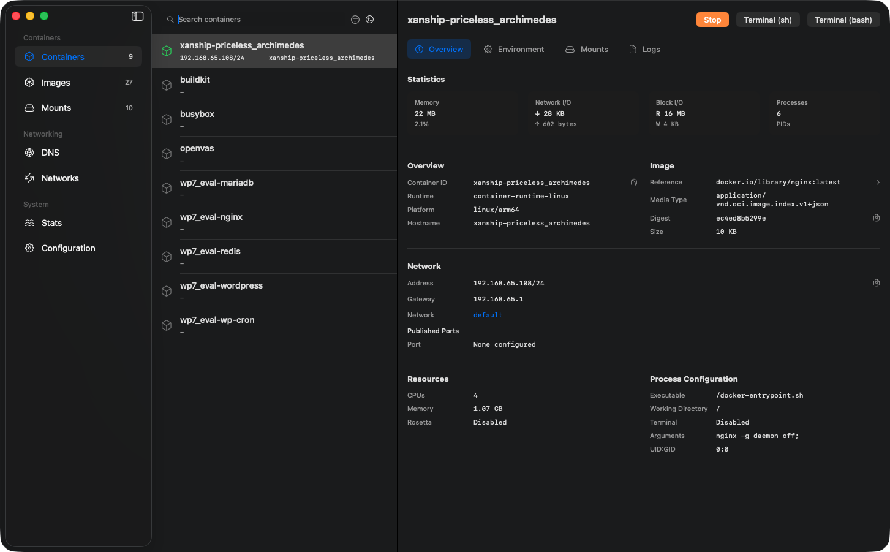

# Xanship

Xanship (transship) is a CLI for moving running Docker containers to Apple Container on macOS.

Japanese documentation is available in [README.ja.md](README.ja.md).

It is intentionally phased rather than live migration:

1. Assess Docker containers with `docker inspect`, `docker volume ls`, and `docker network ls`.
2. Generate an Apple Container migration plan.
3. Optionally load images into Apple Container.
4. Dry-run Apple Container creation.
5. Copy Docker named volume data into Apple Container volumes.
6. Stop the Docker Desktop containers.
7. Start equivalent containers with Apple Container.

## Migration overview

<table>
  <tr>
    <td align="center"><strong>On Docker Desktop</strong></td>
    <td align="center" rowspan="2"><h1>→</h1></td>
    <td align="center"><strong>On Apple Container</strong></td>
  </tr>
  <tr>
    <td align="center"></td>
    <td align="center"></td>
  </tr>
</table>

## Install

Install the latest release from GitHub Releases:

```sh
curl -fsSL https://raw.githubusercontent.com/rioriost/xanship/main/scripts/install.sh | sh
```

Install a specific version:

```sh
curl -fsSL https://raw.githubusercontent.com/rioriost/xanship/main/scripts/install.sh | sh -s -- 0.3.0
```

The installer uses `/usr/local/bin` when it is writable. Otherwise, it installs to `$HOME/.local/bin`. Set `INSTALL_DIR` to choose a different destination:

```sh
curl -fsSL https://raw.githubusercontent.com/rioriost/xanship/main/scripts/install.sh | INSTALL_DIR="$HOME/bin" sh -s -- 0.3.0
```

Release archives and checksums are published at <https://github.com/rioriost/Xanship/releases>.

## Build

```sh
go build ./cmd/xanship
```

## Examples

Assess a single running container:

```sh
xanship assess --container my-container
xanship commands --dry-run
xanship dry-run --apply
xanship load-images
xanship copy-volumes
xanship stop-docker
xanship start-apple
```

Run a compatibility preflight and generate a migration report:

```sh
xanship preflight --plan xanship-plan.json
xanship report --plan xanship-plan.json > xanship-report.md
```

Use safer migration controls:

```sh
xanship assess --container my-container --bind-policy copy-to-volume --existing reuse
xanship copy-volumes --verify
xanship rollback --plan xanship-plan.json
```

Assess a Docker Compose project by label:

```sh
xanship assess --compose-project myproject --service web --exclude-service debug
```

Run all phases in sequence:

```sh
xanship migrate --compose-project myproject
```

Migrate from Docker running on a Linux host over SSH to local Apple Container:

```sh
xanship assess --docker-host ssh://ubuntu@linux-host --container web
xanship load-images --docker-host ssh://ubuntu@linux-host
xanship copy-volumes --docker-host ssh://ubuntu@linux-host --verify
xanship stop-docker --docker-host ssh://ubuntu@linux-host
xanship start-apple
```

`--docker-context CONTEXT` is also supported when the Docker CLI context already points at the Linux source.

The migration plan is written to `xanship-plan.json` with mode `0600` because Docker inspect output commonly contains environment variables and labels that may include secrets.

## Safety and operability features

Xanship includes release-gated migration controls for staged cutovers:

| Feature | Command or option |
| --- | --- |
| Compatibility preflight with port-conflict checks | `xanship preflight --plan xanship-plan.json` |
| Markdown migration report | `xanship report --plan xanship-plan.json` |
| Rollback after a failed cutover | `xanship rollback --plan xanship-plan.json` |
| Idempotent Apple resource handling | <code>--existing fail&#124;reuse&#124;replace</code> |
| Named-volume copy verification | `xanship copy-volumes --verify` / `xanship verify-volumes` |
| Bind-mount policy control | <code>--bind-policy keep&#124;warn&#124;fail&#124;copy-to-volume</code> |
| Plan inspection and editing | `xanship plan summary`, `xanship plan validate`, `xanship plan set` |
| Compose service filtering and ordering | `--service`, `--exclude-service`, `depends_on` ordering |
| Image transfer resilience | Apple Container pull first, Docker save/load fallback |

## Linux Docker sources

In addition to local Docker Desktop on macOS, Xanship can assess and stop Docker containers running on Linux hosts through Docker CLI SSH transport:

```sh
xanship assess --docker-host ssh://user@linux-host --container web
xanship load-images --docker-host ssh://user@linux-host
xanship copy-volumes --docker-host ssh://user@linux-host --verify
xanship stop-docker --docker-host ssh://user@linux-host
xanship start-apple
```

Remote named-volume data is streamed from the Linux Docker host into local Apple Container volumes. Use images with Apple Silicon-compatible variants when the source host is x86_64.

## Tested migrations

Xanship has been tested with 50 representative single-container images and 20 Docker Compose combinations. See [docs/tested.md](docs/tested.md).

Additional end-to-end checks covered:

| Source | Architecture | Docker version | Scenario | Result |
| --- | --- | --- | --- | --- |
| Docker Desktop on macOS | arm64 | 29.6.1 | Representative single containers and Compose projects | Passed |
| Ubuntu Linux on Parallels Desktop | arm64 | 29.1.3 | SSH Docker source, nginx with named volume | Passed |
| CentOS Stream 8 Linux | x86_64 | 26.1.3 | SSH Docker source, `nginx:alpine` with named volume, Apple Container target on Apple Silicon | Passed |

## Verified environment

Xanship 0.3.0 was verified with:

| Component | Version |
| --- | --- |
| macOS | 26.5.2 on Apple Silicon |
| Docker Desktop / Docker Engine | 29.6.1 |
| Apple Container | 1.0.0 |
| container-compose | 1.0.0 |
| Go | 1.22 or later |
| Remote Linux Docker sources | Ubuntu arm64 on Parallels Desktop, CentOS Stream 8 x86_64 over SSH |

## Current scope

Xanship migrates common runtime settings: image, command, entrypoint, environment, labels, working directory, user, TTY/stdin, init, read-only root filesystem, memory/CPU/shm limits, capabilities, DNS settings, published ports, bind mounts, named volumes, tmpfs mounts, user-defined Docker networks, and Compose service selection/order.

Some Docker-specific behavior is reported as warnings in the plan and requires manual review, including restart policies, privileged mode, healthchecks, `extra_hosts`, and non-standard mount types.

Docker labels that cannot be represented by Apple Container, such as values containing `=`, are skipped with warnings in the migration plan.

## Release gate

Before releasing, run:

```sh
make release-check
```

The release gate checks formatting, tests, `go vet`, installer syntax, version injection, and release archive generation for supported platforms.

## License

Xanship is released under the [MIT License](LICENSE).
